# End-to-End Order Testing Business Overview

## Purpose

This document explains, in business terms, how our end-to-end order testing follows a customer order from the first company record through to the final transfer of invoice data to SAP.

The goal is to help business teams, project managers, and delivery stakeholders see the full journey, understand the key handoffs, and recognize where the testing protects revenue, data quality, and customer experience.

## Executive Summary

End-to-end order testing confirms that one order can move cleanly across the full business process:

1. A company and contact are created.
2. A sales opportunity is built with the right products and commercial details.
3. The opportunity becomes a confirmed order.
4. Delivery records are prepared so operational teams can execute the work.
5. Services move through planning, approval, and completion.
6. An invoice is created, checked, and prepared for sending.
7. Final invoice data is transferred to SAP.

This gives the business confidence that commercial data stays complete and accurate from the first sales step to final financial processing.

## Scope and Out of Scope

### Current Scope

This end-to-end testing plan is intentionally focused on the **standard happy-path journey** for a **normal deal created in HubSpot**.

It covers:

- Creation of a company and contact in the standard sales flow.
- Creation of a sales opportunity with products, pricing, and quote alignment.
- Movement from sales completion into order confirmation and delivery preparation.
- Progress of services through the expected planning, approval, execution, and completion stages.
- Creation of an invoice, preparation of the invoice document, and transfer of final invoice data to SAP.
- Validation that core business data remains accurate, connected, and consistent across the full journey.

### Out of Scope for This Phase

This phase does **not** aim to cover every business scenario. It does not include:

- Exception paths, failure handling, or recovery steps when data is incomplete or a handoff fails.
- Non-standard deal journeys, special commercial structures, or manual workaround processes.
- Orders that begin outside the normal HubSpot sales process.
- Cancellation, correction, dispute, or rework scenarios.
- Rare edge cases in approvals, billing rules, or service execution.
- High-volume or peak-load testing across many orders at the same time.

### What This Means for Stakeholders

The current plan is designed to answer a focused business question:

**Does the core order journey work reliably from company creation to SAP handoff for a standard HubSpot-led deal?**

This gives us confidence in the main business flow first. Broader exception coverage can be added later in a future phase.

## End-to-End Journey

```mermaid
flowchart LR
    A[Company created] --> B[Contact added and linked]
    B --> C[Sales opportunity created]
    C --> D[Products and pricing added]
    D --> E[Quote prepared and approved]
    E --> F[Order confirmed]
    F --> G[Project and delivery records created]
    G --> H[Services planned and fulfilled]
    H --> I[Invoice created]
    I --> J[Invoice document prepared and reviewed]
    J --> K[Invoice sent]
    K --> L[Invoice data transferred to SAP]
```

## Business Process Overview

| Stage                | What happens in business terms                                                          | Why it matters                                                                      |
| -------------------- | --------------------------------------------------------------------------------------- | ----------------------------------------------------------------------------------- |
| Company setup        | A new company record is created with its core business details.                         | Ensures the order starts with a clean and trusted customer profile.                 |
| Contact setup        | A decision-maker or day-to-day contact is added and linked to the company.              | Makes sure commercial and billing communication reaches the right person.           |
| Sales opportunity    | A sales opportunity is created and connected to the company and contact.                | Creates a clear commercial record of what is being sold.                            |
| Products and pricing | Order lines are added and enriched with the right descriptions, quantities, and prices. | Protects pricing accuracy and reduces manual correction later.                      |
| Quote approval       | A customer-ready quote is prepared and the opportunity value is aligned to it.          | Keeps the commercial commitment consistent before delivery begins.                  |
| Order confirmation   | The won opportunity is carried into the order management stage.                         | Marks the point where sales intent becomes delivery work.                           |
| Delivery preparation | Project, campaign, and service records are created and linked together.                 | Gives operations a complete structure for planning and execution.                   |
| Service delivery     | Services move through planning, approval, production, and completion.                   | Confirms that delivery can progress with the right approvals and status control.    |
| Invoice creation     | Billing records are created based on the agreed billing model.                          | Supports timely and accurate billing for the work delivered.                        |
| Document preparation | The invoice document is generated and checked before release.                           | Improves billing quality and reduces the risk of customer disputes.                 |
| Finance handoff      | Final invoice data is sent to SAP.                                                      | Ensures finance receives complete, validated information for downstream processing. |

## What the Testing Proves

- Customer, sales, delivery, and finance records stay connected throughout the full order lifecycle.
- Key business information remains consistent as the order moves from one stage to the next.
- Important handoffs happen without manual re-entry of core data.
- Billing can begin only after delivery milestones and validation checks are in place.
- Final finance data reaches SAP in a complete and reliable form.

## Critical Business Control Points

### 1. Clean starting data

The journey starts with a company and contact that are properly linked. This reduces avoidable issues later in quoting, service setup, invoicing, and customer communication.

### 2. Commercial accuracy before execution

Before the order is confirmed, the testing checks that the quote, pricing, quantities, and total order value are aligned. This protects margin and avoids operational confusion.

### 3. Reliable handoff from sales to delivery

Once the opportunity is won, the order moves into delivery preparation. The testing confirms that the order structure needed by operations is created completely and linked back to the original commercial record.

### 4. Controlled service progression

Services do not simply appear as complete. They move through planning, approval, execution, and closure. The testing confirms that these milestones progress in the right order, which supports accountability and visibility for teams.

### 5. Billing readiness and document quality

Invoice creation is checked only after the business conditions for billing are met. The invoice document is then prepared and reviewed so that what is sent out reflects the order accurately.

### 6. Trusted transfer to SAP

Before finance data is handed over to SAP, the process performs completeness checks. This lowers the risk of rejected records, rework, and delayed revenue recognition.

## Business Value

- Reduces revenue leakage by keeping pricing, quantities, and invoice values aligned.
- Lowers manual effort by validating the full handoff chain across sales, operations, and finance.
- Improves confidence in order readiness before teams begin delivery or billing.
- Helps project managers see where delays, missing data, or approval gaps can block progress.
- Supports smoother financial processing by sending validated invoice data to SAP.

## In Simple Terms

This end-to-end test answers one business question:

**Can we create a new customer order, fulfill it, bill it correctly, and pass it to SAP without losing information or creating avoidable manual work?**

If the answer is yes, stakeholders can trust that the order process is not only working, but working in a way that supports scale, control, and reliable revenue operations.